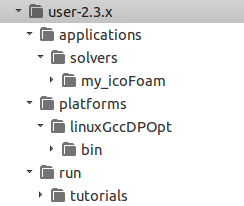
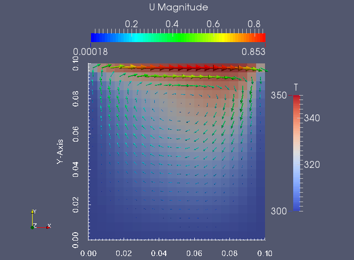

# OpenFOAMのカスタマイズ・ソースコード改造 超入門 #

## 目的 ##

今回の講習の目的は，OpenFOAMをカスタマイズ（ソースコードを変更する）ための手順の全体像を学ぶことである。時間に制約があるため，ソースコードの詳細には触れない。

## 参考情報 ##
http://openfoamwiki.net/index.php/How_to_add_temperature_to_icoFoam

[http://openfoamwiki.net/index.php/How_to_add_temperature_to_icoFoam](http://openfoamwiki.net/index.php/How_to_add_temperature_to_icoFoam "http://openfoamwiki.net/index.php/How_to_add_temperature_to_icoFoam")

## 環境 ##

この資料は，OpenFOAM 2.3.0 を基準として作成した。この資料の元となる openfoamwiki は 1.7 に対するものであるが，ほとんど同じ内容のままである。その間のバージョンであれば，問題なく適用できるはず。

## 手順 ##

1.   ベースとなるコードの選定
2.   ベースコードをユーザ作業ディレクトリに複製
3.   ベースコードを新しい名前のソルバにする（名前の変更作業のみ：中身はそのまま）
4.   ベースコードがコンパイルできることを確認する
5.   コンパイルしたベースコードが実行できることを確認する
6.   コードの変更（その1：createFields.H）
7.   コードの変更（その2：my_icoFoam.C）
8.   コンパイル
9.   例題の変更
10.  実行
11.  ファイル：ソースコードと例題
12.  付録：関連するディレクトリの調査

## 実作業 ##

### 1. ベースとなるコードの選定 ###

OpenFOAMからオリジナルコードを作成する時には，既存のコードから目的に近いモノを選び，修正していくことを推奨する。

今回は，非定常，非圧縮，層流を解くicoFoamをベースとする。これに，温度場を求めるためのエネルギー方程式を追加する。

### 2. ベースコードをユーザ作業ディレクトリに複製 ###

使用しているOpenFOAMの環境を確認する。OpenFOAMのインストールされているディレクトリを下記コマンドを実行して確認する。

    コマンド	echo $WM_PROJECT_DIR
    実行結果	/home/user/OpenFOAM/OpenFOAM-2.3.x

インストールしたOpenFOAMのソースコードは，`$WM_PROJECT_DIR/applications/solvers` に保存されている。このディレクトリは，`$FOAM_SOLVERS` 変数に格納されている。

ユーザーがソースコードを格納したり，例題を実行したりするディレクトリは，各ユーザーのホームディレクトリ内に作ることが推奨されている。ユーザーのプロジェクトディレクトリ内に，目的ごとにディレクトリを作成する。
ユーザーのプロジェクトディレクトリは， `$WM_PROJECT_USER_DIR` に格納されている。

下記コマンドを実行して，ユーザーのプロジェクトディレクトリを確認する。

    コマンド	echo $WM_PROJECT_USER_DIR
    実行結果	/home/user/OpenFOAM/user-2.3.x

実行前のディレクトリ構造。実行用ディレクトリ run だけが存在する。

一般的には，カスタマイズしたソルバは， `$WM_PROJECT_USER_DIR/applications/solvers` に保存する。

OpenFOAMインストール時の実行ファイルは，`$FOAM_APPBIN` ディレクトリに格納されている。

    コマンド	echo $FOAM_APPBIN
    実行結果	/home/user/OpenFOAM/OpenFOAM-2.3.x/platforms/linuxGccDPOpt/bin

本当に？確かめよう。icoFoamがどこにあるかは，次のコマンド（`which`）で確認できる。

    コマンド	which icoFoam
    実行結果	/home/user/OpenFOAM/OpenFOAM-2.3.x/platforms/linuxGccDPOpt/bin/icoFoam

コンパイルに成功すると生成される実行ファイルは，`$FOAM_USER_APPBIN` に格納する。

    コマンド	echo $FOAM_USER_APPBIN
    実行結果	/home/user/OpenFOAM/user-2.3.x/platforms/linuxGccDPOpt/bin

ユーザのソルバ・ソースコード・ディレクトリ（`$WM_PROJECT_USER_DIR/applications/solvers`）を作成する。

    mkdir -p $WM_PROJECT_USER_DIR/applications/solvers

> ファイルマネージャーで操作する場合
> 
> $WM_PROJECT_USER_DIR を開く。
> 
> 新しいディレクトリを作成して，applications という名前にする。
> 
> applicationsディレクトリの中に入る。
> 
> 新しいディレクトリを作成して，solvers という名前にする。

ユーザのソルバ・ソースコード・ディレクトリ（`$WM_PROJECT_USER_DIR/applications/solvers`）に，システムのソースコード・ディレクトリ（`$FOAM_SOLVERS/incompressible/`）から，icoFoamディレクトリをコピーする。コピーしたディレクトリは， *my_icoFoam* という名前にする。

    cp -r $FOAM_SOLVERS/incompressible/icoFoam $WM_PROJECT_USER_DIR/applications/solvers/my_icoFoam

> ファイルマネージャーで操作する場合
> 
> $FOAM_SOLVERS/incompressible/ を開く。
> 
> icoFoamディレクトリをコピーする。
> 
> $WM\_PROJECT\_USER_DIR/applications/solvers を開く。
> 
> コピーしたicoFoamディレクトリを貼付け，名前をmy_icoFoamに変更する。
> 

### 3. ベースコードを新しい名前のソルバにする（名前の変更作業のみ：中身はそのまま） ###

my_icoFoam ディレクトリへ移動する

    cd $WM_PROJECT_USER_DIR/applications/solvers/my_icoFoam

icoFoam.Cファイルの名前をmy_icoFoam.Cに変更する

    mv icoFoam.C my_icoFoam.C

不要なファイル（icoFoamコンパイル時に生成されていたもの）を削除する

    rm icoFoam.dep

Make subdirectory の 'files' file を修正する。エディタを起動し，`$WM_PROJECT_USER_DIR/applications/solvers/my_icoFoam/Make/files` ファイルを開く。その内容を，下記の通りに書き換える。書き換えが終われば，保存してエディタを終了する。

    my_icoFoam.C
    EXE = $(FOAM_USER_APPBIN)/my_icoFoam

このfilesファイルでは，コンパイルするファイル名と，コンパイルした後の保存先とファイル名を指定している。保存先がユーザーの実行ファイルディレクトリになっていることに注意する。

不要なディレクトリを削除する（icoFoamコンパイル時に生成されていたもの）

    rm -rf Make/linuxGccDPOpt

> ファイルマネージャーで操作する場合
> 
> $WM_PROJECT_USER_DIR/applications/solvers/my_icoFoamディレクトリを開く。
> 
> icoFoam.Cファイルの名前を，my_icoFoam.C に変更する。
> 
> 不要なファイル icoFoam.dep を削除する。
> 
> Makeディレクトリに入る。
> 
> files ファイルをダブルクリックして開く。その中身を下記の様に修正して，保存する。
> 
> >    my_icoFoam.C
> 
> >    EXE = $(FOAM_USER_APPBIN)/my_icoFoam
> 
> Makeディレクトリ内にあるlinuxGccDPOpt ディレクトリを削除する。

### 4. ベースコードがコンパイルできることを確認する ###

my_icoFoam ディレクトリへ移動する。（先ほどと同じ場所）

    cd $WM_PROJECT_USER_DIR/applications/solvers/my_icoFoam

下記のコマンドを実行して，ソースコードをコンパイルする。

    wmake

実行ファイルができたことを確認するため，下記コマンドを実行する。 my\_icoFoam が存在すればOK。コンパイル時にエラーが発生しないにもかかわらず、my_icoFoam が見当たらない場合は，Make/files ファイルにおいて、EXE= 以下の指定がちがう可能性が高い。

    ls $FOAM_USER_APPBIN

実行後のディレクトリ構造。ソルバ用，実行形式ファイル用，実行用ディレクトリが存在する。

### 5. コンパイルしたベースコードが実行できることを確認する ###

ベースとなったicoFoam用の例題 cavity を，`my_icoFoam_cavity` という名前にして，ユーザの実行ディレクトリに複製する。

    cd $FOAM_RUN/tutorials/incompressible/icoFoam

    cp -r cavity $FOAM_RUN/my_icoFoam_cavity

> ファイルマネージャーで操作する場合
> 
> $FOAM_RUN/tutorials/incompressible/icoFoam ディレクトリを開く。
> 
> cavity ディレクトリをコピーして，$FOAM_RUN ディレクトリに貼り付ける。名前を `my_icoFoam_cavity` に変更する。

新しく作成したディレクトリに移動して，my_icoFoam を実行する。エラーが発生せず、実行できればOK。

    cd $FOAM_RUN/my_icoFoam_cavity
    blockMesh
    my_icoFoam

### 6. コードの変更（その1：createField.H） ###

ここから，ソースコードの改造に入る。まず，$WM\_PROJECT\_USER_DIR/applications/solvers/createField.H ファイルに，DT と T を追記する。

DTは熱拡散率であり，速度場のnuに対応するものである。nuと同様に，次元を持つスカラー量 dimensionedScalar 型とする。transportProperties ファイルから値を読み込む。

Tは温度場である。圧力と同様に，セル中心で値を持つスカラー量 volScalarField 型とする。圧力などと同様に，計算時には時刻ディレクトリ（runTime.tiimeName()）から値を読み込み/書き出しする。

下記に追記する部分の内容を記す。詳細は別途配布資料を参照のこと。

    Info<< "Reading transportProperties\n" << endl;

    IOdictionary transportProperties
    (
        IOobject
        (
            "transportProperties",
            runTime.constant(),
            mesh,
            IOobject::MUST_READ,
            IOobject::NO_WRITE
        )
    );
    
    dimensionedScalar nu
    (
         transportProperties.lookup("nu")
    );
    //Add here...
    dimensionedScalar DT
    (
         transportProperties.lookup("DT")
    );
    //Done for now...

    Info<< "Reading field T\n" <<endl;
    volScalarField T
    (
        IOobject
        (
             "T",
             runTime.timeName(),
             mesh,
             IOobject::MUST_READ,
             IOobject::AUTO_WRITE
         ),
         mesh
    );

### 7. コードの変更（その2：my_icoFoam.C） ###

次に，my_icoFoam.C に，温度場の式を追加する。温度場の基礎式は速度場と同様であり，Uの式を参考にする。UはVectorであるが，温度はスカラーなので，fvScalarMatrix として温度を求めるための行列 TEqn を定義し，解く。 

下記に追記する部分の内容を記す。詳細は別途配布資料を参照のこと。
    
                 U -= rUA*fvc::grad(p);
                 U.correctBoundaryConditions();
            }
                
    //add these lines...
            fvScalarMatrix TEqn
            (
                fvm::ddt(T)
                + fvm::div(phi, T)
                - fvm::laplacian(DT, T)
            );

            TEqn.solve();
    //done adding lines...
    
            runTime.write();

実行とは直接関係しないが，このファイルの冒頭コメント部にある Application を icoFoam から my_icoFoam に修正しておく。

### 8. コンパイル ###

    cd $WM_PROJECT_USER_DIR/applications/solvers/my_icoFoam

    wmake

### 9. 例題の変更 ###

先に作成した例題ディレクトリ `my_icoFoam_cavity` を変更して，温度関係の設定を追加する。

まず，先ほどの計算結果を削除して初期状態に戻すため，`foamCleanTutorials` を実行する。

    cd $FOAM_RUN/my_icoFoam_cavity
    foamCleanTutorials

constant/transportProperties に，nuを参考にして，DTを追加する。単位はどちらも同じで，mの2乗とsの-1乗である。値を0.002とする。

    DT            DT [0 2 -1 0 0 0 0] 0.002;

0/ ディレクトリに，T ファイルを追加する。 pファイルを複製して、名前をTとする。内容は下記の通り。流体温度の初期値を300度，上部の移動壁を350度に固定し，その他の壁面は300度に固定する。

       class           volScalarField;
        object          T;
    }
    //**********************************//
    
    dimensions       [0 0 0 1 0 0 0];
    
    internalField    uniform 300;
    
    boundaryField
    {
        movingWall
        {
            type        fixedValue;
            value       uniform 350;
        }

        fixedWalls
        {
            type        fixedValue;
            value       uniform 300;
        }

        frontAndBack
        {
            type        empty;
        }
    }

system/fvSchemes ファイルに，温度場の解き方に関する設定を追加。OpenFOAMのバージョンが2.2以前の場合には，下記に加えてlaplacianSchemes にも追加が必要である。Uの場合と同様とすればよい。

    divSchemes
    {
        default         none;
        div(phi,U)      Gauss linear;
        div(phi,T)      Gauss upwind; //NOTICE: there is no space between the comma and the variables
    }

system/fvSolution ファイルに，温度場の解き方に関する設定を追加。

    solvers
    {
        p
        {
            //information about the pressure solver
        };
    //add this...
        T 
        {
           solver            BICCG;
            preconditioner   DILU;
            tolerance        1e-7;
            relTol           0;
        };
    //done editing...

### 10. 実行 ###

例題ディレクトリから，新しく作成したソルバ my_icoFoam を実行する。

    cd $FOAM_RUN/my_icoFoam_cavity
    blockMesh
    my_icoFoam 

paraFoam で可視化した結果の一例

### 11. ファイル：ソースコードと例題 ###

新ソルバのソースコード

例題

---

## 12. 付録：関連するディレクトリの調査 ##

下記の環境変数の値（ディレクトリ）を確認しましょう。

端末から，環境変数の値を表示するためのコマンド「echo」を実行して，結果として出力された文字列をメモしてください。

環境変数名の前には，$ 記号を付けて実行します。

    実行例    echo $WM_PROJECT_DIR

##### システムのプロジェクトディレクトリ #####

    $WM_PROJECT_DIR

    あなたの環境　＝　_________________________________

##### システムのソルバ・ソースコード・ディレクトリ #####

    $FOAM_SOLVERS

    あなたの環境　＝　_________________________________

##### システムの実行ファイル(bin)ディレクトリ #####

    $FOAM_APPBIN

    あなたの環境　＝　_________________________________

##### システムの例題ファイル格納ディレクトリ #####

    $FOAM_TUTORIALS

    あなたの環境　＝　_________________________________

##### ユーザーのプロジェクトディレクトリ #####

    $WM_PROJECT_USER_DIR

    あなたの環境　＝　_________________________________

##### ユーザーのソルバ・ソースコード・ディレクトリ #####

    $WM_PROJECT_USER_DIR/applications/solvers

    あなたの環境　＝　_________________________________

##### ユーザーの実行ファイル(bin)ディレクトリ #####

    $FOAM_USER_APPBIN

    あなたの環境　＝　_________________________________

##### ユーザーの作業（実行）ディレクトリ #####

    $FOAM_RUN

    あなたの環境　＝　_________________________________

なお，これらの環境変数は，`$WM_PROJECT_DIR/etc/config/settings.sh` ファイルの中で設定されている。 
これらのディレクトリに移動するためのコマンドが，alias として，`$WM_PROJECT_DIR/etc/config/aliases.sh` で設定されている。
これらの設定ファイルは，OpenFOAMインストール作業の一環として，`.bashrc`ファイルに追記する `
source $HOME/OpenFOAM/OpenFOAM-2.3.x/etc/bashrc` という行によって，端末を起動する度に読み込まれることとなる。
